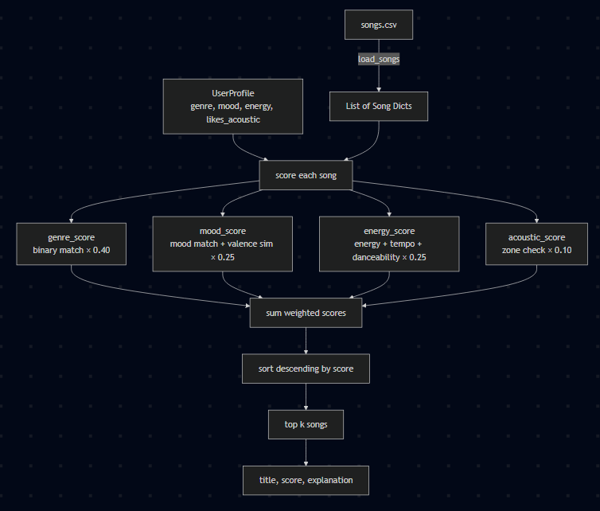
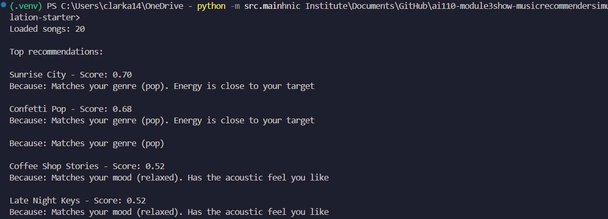
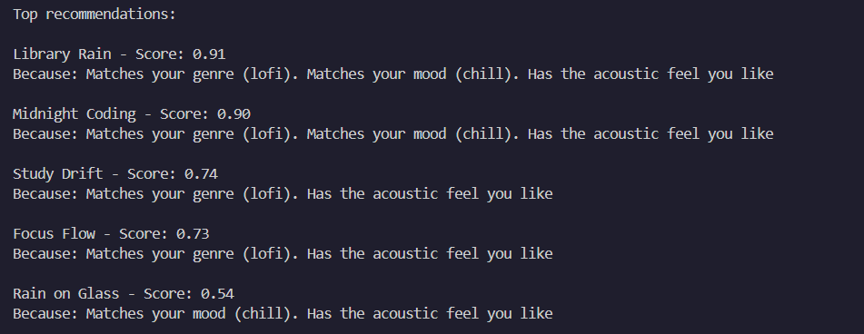
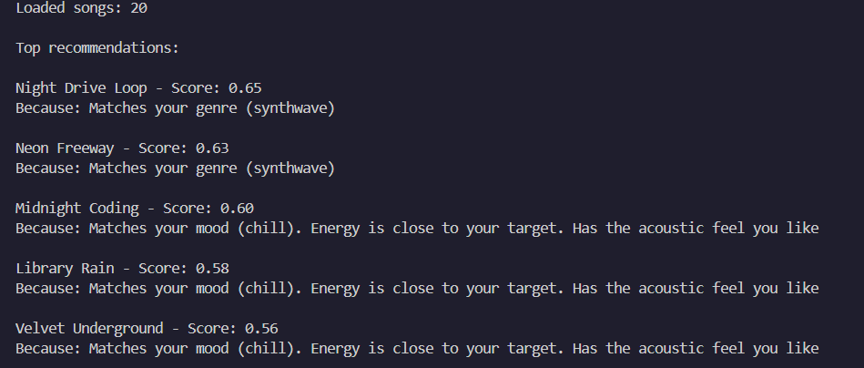
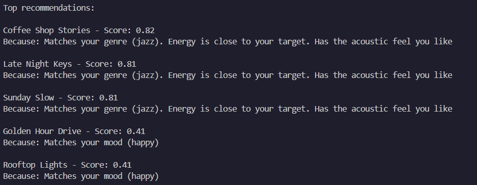

# 🎵 Music Recommender Simulation

## Project Summary

In this project you will build and explain a small music recommender system.

Your goal is to:

- Represent songs and a user "taste profile" as data
- Design a scoring rule that turns that data into recommendations
- Evaluate what your system gets right and wrong
- Reflect on how this mirrors real world AI recommenders

Replace this paragraph with your own summary of what your version does.

---

## How The System Works
My implementation of the Music Recommender is a content-based recommendation system that uses song attributes to select the best songs that fit the user's preferences. the `UserProfile` will contain the attributes:
 - favorite_genre
 - favorite_mood
 - target_energy
 - likes_acoustic

### Algorithm Recipe

The scoring system uses these attributes to score:
- genre: category of song composition
- mood: category of emotion evoked by song
- energy: perceived emotional drive/intensity
- tempo or bpm: speed of song
- valence: positivity of a song
- danceability: suitablity of a song to be danced to
- acousticness: measure of how much unplugged, natural sound is used

The Scoring algorithm calculates a genre, mood, energy, and acoustic score and multiplied by fixed weights based on how I think songs should be scored.

```python
score = 0.40 * genre_score
      + 0.25 * mood_score
      + 0.25 * energy_score
      + 0.10 * acoustic_score
```


The genre score is a binary match, meaning that it will only be considered if it matches the user's preferred genre.

```python
genre_score = 1 if song.genre == user.favorite_genre else 0
```


The mood score is a composite feature based on a binary mood match and a valence similarity sub-feature. The mood-valence mapping is also a fixed number based on what I intuitively think it correlates to(higher valence = happier mood)

```python
MOOD_VALENCE = {
    "happy": 0.80, "chill": 0.55, "intense": 0.50,
    "relaxed": 0.70, "focused": 0.55, "moody": 0.35
}
mood_match       = 1 if song.mood == user.favorite_mood else 0
valence_target   = MOOD_VALENCE.get(user.favorite_mood, 0.5)
valence_sim      = 1 - abs(song.valence - valence_target)
mood_score       = 0.7 * mood_match + 0.3 * valence_sim
energy_score — composite
```


The energy score is based on energy similarity, which is a composite feature utilizing a normalized tempo/bpm and song danceability metrics. To keep it simple, the tempo/bpm was normalized by subtracting the lowest bpm in the dataset (60 bpm) from the song's bpm, and dividing it by the difference between the highest (152 bpm) and lowest bpm. 

```python
norm_tempo       = (song.tempo_bpm - 60) / 92   # normalizes to [0, 1] for dataset range 60-152
composite_energy = 0.5 * song.energy + 0.3 * norm_tempo + 0.2 * song.danceability
energy_score     = 1 - abs(composite_energy - user.target_energy)
```


The acoustic score is based on binary range check that reads a boolean that determines whether the song fits the acoustic preference.

```python
acoustic_score = 1 if (song.acousticness >= 0.5) == user.likes_acoustic or else 0
```

### The Plan




**Input:** `songs.csv` is loaded into a list of song dictionaries. A `UserProfile` provides the target preferences: `favorite_genre`, `favorite_mood`, `target_energy`, and `likes_acoustic`.

**Process:** Each song is scored independently against the user profile using four weighted features. Genre and acousticness use binary rules (match or no match). Mood is a composite of a binary mood match and a valence similarity sub-score. Energy is a composite of the song's raw energy, normalized tempo, and danceability — all blended into a single proximity score against `target_energy`.

**Output:** All songs are sorted descending by their final score and the top `k` are returned, each with a score and a plain-language explanation.

### Expected Output

**Primary User Profile** — `genre: pop, mood: relaxed, energy: 0.71, likes_acoustic: True`



**Energy Paradox Profile** — `genre: lofi, mood: chill, energy: 0.0, likes_acoustic: True`



**Genre Intruder Profile** — `genre: synthwave, mood: chill, energy: 0.40, likes_acoustic: True`



**Valence Trap Profile** — `genre: jazz, mood: happy, energy: 0.40, likes_acoustic: True`



### Potential Biases
The Scoring Rule, puts a heavy bias toward genre since people don't often listen outside out of their preferred genre of music. However, if the listener listens to a lot of different music and varying preferences, the recommendation system would not be robust enough to take those into consideration. The same goes for mood as well, but with slightly less effect.

---

## Getting Started

### Setup

1. Create a virtual environment (optional but recommended):

   ```bash
   python -m venv .venv
   source .venv/bin/activate      # Mac or Linux
   .venv\Scripts\activate         # Windows

2. Install dependencies

```bash
pip install -r requirements.txt
```

3. Run the app:

```bash
python -m src.main
```

### Running Tests

Run the starter tests with:

```bash
pytest
```

You can add more tests in `tests/test_recommender.py`.

---

## Experiments You Tried

When I was testing a user profile (Genre Intruder) designed to check if genre score overpowers the mood, energy, and acoustic scores, I noticed that the "Night Drive Loop" and "Neon Freeway" was beating out all other recommendations solely on the fact that they were genre matches.
So in my experiment, I balanced out the weights so that genre/mood/energy/acoustic split was 30/30/30/10 instead of 40/25/25/10. After testing it, "Night Drive Loop" and "Neon Freeway" were no longer ranked, meaning the genre bias was removed or at least decreased.

When I was testing a user profile (Valence Trap) designed to check if valence score could inflate mood scores. I wanted to see what happen if valence_similarity had more influence.
When I tweaked the mood_match and valence_similarity weights to 0.5, the top three recommendations remained the same since it matched genre, energy, and acoustic preference; however, the last two changed. In the previous run, the last two were selected due to mood match, but in the new run, the reason was based more on energy and acousticness. The mood match had less affect on the overall mood score. 

---

## Limitations and Risks

Summarize some limitations of your recommender.

Examples:

- It only works on a tiny catalog
- It does not understand lyrics or language
- It might over favor one genre or mood

You will go deeper on this in your model card.

---

## Reflection

Read and complete `model_card.md`:

[**Model Card**](model_card.md)

Write 1 to 2 paragraphs here about what you learned:

- about how recommenders turn data into predictions
- about where bias or unfairness could show up in systems like this


---

## 7. `model_card_template.md`

Combines reflection and model card framing from the Module 3 guidance. :contentReference[oaicite:2]{index=2}  

```markdown
# 🎧 Model Card - Music Recommender Simulation

## 1. Model Name

Give your recommender a name, for example:

> VibeFinder 1.0

---

## 2. Intended Use

- What is this system trying to do
- Who is it for

Example:

> This model suggests 3 to 5 songs from a small catalog based on a user's preferred genre, mood, and energy level. It is for classroom exploration only, not for real users.

---

## 3. How It Works (Short Explanation)

Describe your scoring logic in plain language.

- What features of each song does it consider
- What information about the user does it use
- How does it turn those into a number

Try to avoid code in this section, treat it like an explanation to a non programmer.

---

## 4. Data

Describe your dataset.

- How many songs are in `data/songs.csv`
- Did you add or remove any songs
- What kinds of genres or moods are represented
- Whose taste does this data mostly reflect

---

## 5. Strengths

Where does your recommender work well

You can think about:
- Situations where the top results "felt right"
- Particular user profiles it served well
- Simplicity or transparency benefits

---

## 6. Limitations and Bias

Where does your recommender struggle

Some prompts:
- Does it ignore some genres or moods
- Does it treat all users as if they have the same taste shape
- Is it biased toward high energy or one genre by default
- How could this be unfair if used in a real product

---

## 7. Evaluation

How did you check your system

Examples:
- You tried multiple user profiles and wrote down whether the results matched your expectations
- You compared your simulation to what a real app like Spotify or YouTube tends to recommend
- You wrote tests for your scoring logic

You do not need a numeric metric, but if you used one, explain what it measures.

---

## 8. Future Work

If you had more time, how would you improve this recommender

Examples:

- Add support for multiple users and "group vibe" recommendations
- Balance diversity of songs instead of always picking the closest match
- Use more features, like tempo ranges or lyric themes

---

## 9. Personal Reflection

A few sentences about what you learned:

- What surprised you about how your system behaved
- How did building this change how you think about real music recommenders
- Where do you think human judgment still matters, even if the model seems "smart"

